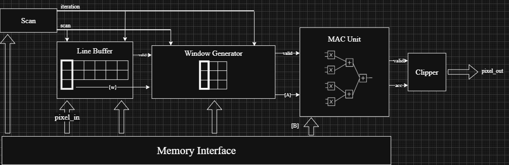
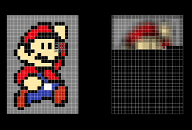

# FPGA 3x3 Convolutional Accelerator

A configurable 3x3 convolutional accelerator for image processing. 
The design uses a streaming, pipelined architecture consisting of a scan module,
line buffers, a window generator, a signed multiply-accumulate (MAC) unit,
and an output clipper

The accelerator is written in Verilog and is to be implemented on the Digilent Zybo Z7-10 FPGA

  

## Overview

Two-dimensional convolution is a critical operation in image processing that allows us to detect and extract features of an image.
It works as follows: an NxN matrix of coefficients, referred to as the kernel, is slid across an image in raster order and "convolved" with the overlapping NxN patch of the input image.
To "convolve" in this case means to multiply the overlapping scalars in the patch (the coefficients and the pixel values) and sum all NxN products.
The accumulated result then becomes the pixel value for the new, processed image.

  

Kernels are often designed to emphasize certain features of an image. A famous example is the Sobel filter.

  

Modern CPUs could run convolutional math, but for applications requiring fast response and minimal power consumption,
they are too slow and require too much power. For instance, a single MAC operation on an NxN window executed on a CPU needs to
compute 
N2
 products (and hence 
N2
 steps), whereas a specialized accelerator could compute all 
N2

products in a single step by parallelizing the multiply operation. Furthermore, in a CPU, huge amounts of energy are wasted by moving filter
coefficients back and forth from memory. A dedicated convolutional accelerator avoids this by storing the values statically in a dedicated
memory block.

With the rise of Convolutional Neural Networks (CNNs), where multiple convolutions are performed repeatedly on an image, there is a
rapidly growing need for specialized convolutional accelerators that could perform inference quickly on energy-constrained edge devices.

